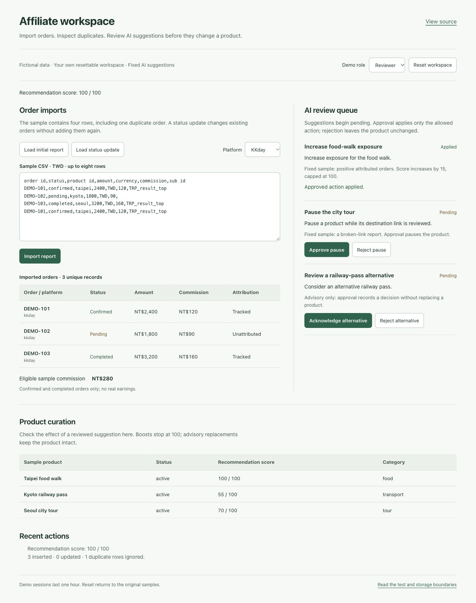

# TBTI Affiliate Agent

A full-stack affiliate operations MVP for importing orders, attributing commissions, and reviewing AI product changes.

[Try the sample workspace](https://tbti-affiliate-demo.vercel.app/demo) · [Workflow and test evidence](docs/affiliate-agent/DEMO.md) · [Architecture](docs/affiliate-agent/PLAN.md) · [CI](https://github.com/Lother13501350/tbti-affiliate-agent/actions/workflows/build.yml)



Actual browser capture on October 6, 2026. All orders, products, commissions, and suggestions are fictional. The operations interface remains in Traditional Chinese; the public demo uses English.

## Try the workflow

No account or API key is required. Every browser gets its own resettable sample session.

1. **Import report:** four CSV rows produce three unique orders and one ignored duplicate.
2. **Import it again:** the identical report is skipped; the order count stays at three.
3. **Load status update → Import report:** existing orders change, including a refund. Eligible sample commission changes from TWD 280 to TWD 250.
4. **Select Viewer → Check permission:** the server returns 403. Switching demo roles does not grant access to operations administration.
5. **Select Reviewer → Approve boost:** the product score moves from 92 to its cap of 100. Rejecting a pause leaves the product unchanged; approving a replacement records an advisory decision without replacing it.

**Reset workspace** restores the samples. Suggestions are fixed fixtures, so the demo makes no paid AI calls. Sessions expire after one hour.

## What I maintain

The Next.js admin and API workflows, PostgreSQL domain records, platform adapters, CSV normalization and attribution, constrained AI tools, and reviewed proposal execution. The portfolio extension adds an isolated public demo and executable evidence for duplicate imports, access boundaries, concurrency, and rollback behavior.

The application remains an **MVP**. No user, revenue, throughput, or test-coverage percentage is claimed.

## Architecture

```text
OPERATIONS
Admin UI → shared-key guard → domain modules → Neon PostgreSQL
CSV → platform adapter → validated records → atomic import function
AI optimizer → pending proposal → human decision → atomic product + audit write
Product CTA → /go/<code> → contextual SubId → best-effort click log → platform
Daily cron → link health + metrics → optional Discord report

PUBLIC DEMO (separate deployment)
React workspace → /api/demo → shared normalization / decision rules
                           → signed, compressed HttpOnly sample-session cookie
```

The public demo uses server-validated cookie state and never connects to the operations database. Real database guarantees are tested separately against the **same PostgreSQL table/function definitions used by operations**. The cookie adapter is bounded to eight fictional orders and is not a concurrent, multi-user database: parallel tabs can overwrite the same sample session. See [storage boundaries](docs/affiliate-agent/DEMO.md).

The optional Claude Agent SDK optimizer requires a local or other Node host; its native runtime is excluded from Vercel function tracing. The public demo demonstrates the review workflow with prepared suggestions, not live model quality.

## Engineering decisions

- **Atomic import rather than a file check followed by row writes.** A PostgreSQL advisory transaction lock serializes the same platform/report hash. `(platform, external_order_id)` identifies an order; changed reports update existing rows. A failed batch rolls back both orders and its import receipt.
- **Approval is a state transition, not arbitrary execution.** A proposal row lock prevents replayed/concurrent decisions from applying twice. Product changes, proposal status, and audit persistence commit together. Boosts add 15 up to 100; replacements and gap suggestions stay advisory. Missing targets or failed audit writes leave the proposal pending.
- **A public sample boundary independent of admin access.** The demo API verifies cookie signatures, expiry, origin, and roles on the server. Admin APIs fail closed without a configured key. Demo cookies and forged role fields cannot authorize operations requests.

Review [workflow SQL](src/lib/workflow-sql.ts), [normalization and decisions](src/lib/workflows.ts), [demo handler](src/lib/demo/handler.ts), and [database tests](tests/postgres.integration.test.ts).

## Implemented operations features

Product lifecycle and review queues; affiliate URL/SubId adapters for KKday, Klook, Trip.com, and generic links; redirect tracking; product/order CSV imports; commission and attribution reports; broken-link checks and coverage gaps; optional OpenAI classification; reviewed Claude proposals; optional daily Discord reports. The cron does **not** download platform order reports.

## Tech stack

| Layer | Implementation |
| --- | --- |
| Web / API | Next.js App Router, React, TypeScript, Zod |
| Operations data | Neon PostgreSQL HTTP client, PL/pgSQL transactions |
| Public samples | HMAC-signed compressed HttpOnly cookie, fixed fixtures |
| AI / integration | OpenAI, Claude Agent SDK, CSV/platform adapters |
| Delivery / testing | Vercel, GitHub Actions, Node test runner + tsx, PostgreSQL integration tests |

## Run locally

Use Node.js 22 or 24 and npm.

```bash
git clone https://github.com/Lother13501350/tbti-affiliate-agent.git
cd tbti-affiliate-agent
npm ci
cp .env.example .env.local
npm run dev
```

Open `http://localhost:3000/demo`. Development has a local-only signing fallback, so no database or AI credentials are needed. For a production build, configure a random `DEMO_SESSION_SECRET` of at least 32 characters; missing configuration returns 503.

Operations require `DATABASE_URL` and `ADMIN_KEY`. Admin pages currently accept `?key=<your-local-key>`; APIs also accept `x-admin-key`. Query keys can appear in history/logs. This is shared-key MVP access, not individual accounts or production RBAC.

## Verification

On October 6, 2026: **55 passing tests, zero skips**, plus passing typecheck, lint, and production build.

| Suite | Checks | Evidence |
| --- | ---: | --- |
| `npm test` | 37 | CSV validation, status mapping, bounded decisions, signed sessions, role enforcement, admin denial |
| `npm run test:db` | 16 | Real PostgreSQL import/decision SQL, concurrent requests, failure rollback, audit atomicity |
| `npm run test:http` | 2 | Actual built Next.js server, cookies, full sample workflow, origin/session denial |

```bash
npm test
npm run typecheck
npm run lint
npm run build
npm run test:http
```

For database checks, create an **exclusive local test database** on an already running PostgreSQL instance:

```bash
createdb affiliate_test
TEST_DATABASE_URL=postgresql://localhost/affiliate_test npm run test:db
```

The database suite truncates its affiliate tables between tests. It refuses missing configuration, non-local hosts, database names that do not end in `_test`, or the operations `DATABASE_URL`. GitHub Actions provides an isolated PostgreSQL 16 service and runs all three suites plus static/build checks. Browser operation and desktop/mobile layout were also checked manually; there is no automated browser suite or published coverage measurement.

## Configuration and deployment

[.env.example](.env.example) lists the full configuration. The demo needs only `DEMO_SESSION_SECRET`. Operations use `DATABASE_URL`, `ADMIN_KEY`, `CLICK_HASH_SALT`, and `CRON_SECRET`; `AGENT_WRITE_ENABLED` defaults to false and gates selected automation paths, not all database writes. Discord and AI credentials are optional.

Deploy the public samples to a separate Vercel project using **`vercel.demo.json`**, which has no cron schedule. Operations use `vercel.json`, with daily checks at 01:00 UTC. [Deployment instructions](docs/affiliate-agent/DEPLOY.md) cover both environments and the database privileges required by the lazy schema helpers.

## Remaining limits

Versioned schema migrations and individual admin identities remain future work. Actual partner-report formats, live provider behavior, deployment data, and production load were not verified by these sample tests. Dependency advisories remain tracked; the Next.js runtime was updated during this work, but a passing build does not establish that every dependency is free of vulnerabilities. Click hashes are not a claim of irreversible anonymity. No license file is included.
