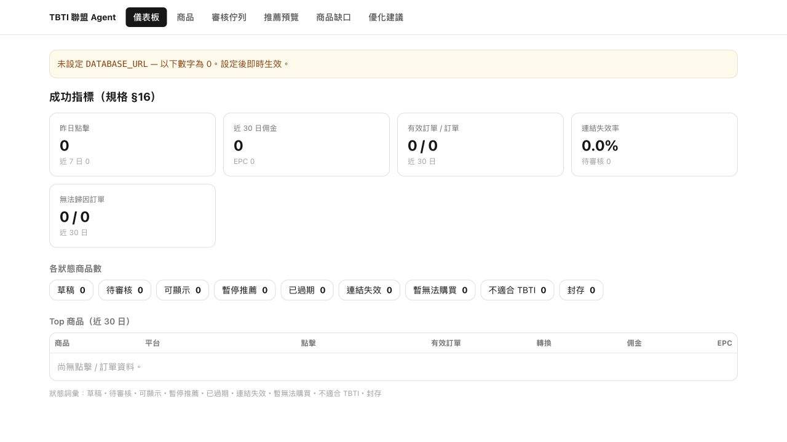

# TBTI Affiliate Agent

An affiliate operations MVP for managing product links, attributing clicks, importing order reports, and reviewing AI optimization proposals.

[Hosted service](https://tbti-affiliate-agent.vercel.app) · [Deployment](docs/affiliate-agent/DEPLOY.md) · [Design and scope](docs/affiliate-agent/PLAN.md)

## Overview and status

This service supports a travel-product operator's workflow: review products, compose affiliate links, track redirects, import platform CSV reports, and inspect commissions and unattributed orders. It is a Next.js application with an administration interface and Neon PostgreSQL storage.

The hosted instance is an operations environment, with protected admin routes. It is not an open interactive admin demo. The implementation is an **MVP**: there is no automated unit/integration test framework or published coverage, user, or revenue metric. The database connection is deployment-specific; the deployment guide recommends a dedicated database rather than assuming access to another product's database.

## Screenshot



Captured locally on October 6, 2026, with no database credentials. The visible zeros and empty table demonstrate the unconfigured state; they are not business results. Product UI remains in Traditional Chinese.

## Implemented features

- Product lifecycle states, review queues, taxonomy, persona tags, and recommendation previews.
- Affiliate link construction and platform-specific SubId adapters for KKday, Klook, Trip.com, and generic links.
- Redirect tracking at `/go/<code>`; click logging is best-effort and does not block a valid redirect when logging fails.
- CSV product/order imports, file-hash deduplication, and unique platform/order identifiers.
- Revenue and attribution reports, broken-link checks, and product-coverage gaps.
- Optional OpenAI classification and a Claude advisory optimizer whose proposals require review before application code executes them.
- Daily health checks and metrics reports, with optional Discord delivery. The daily cron does **not** automatically fetch platform order reports.

## Architecture

```text
Admin UI -> guarded admin APIs -> domain modules -> Neon PostgreSQL
Product CTA -> /go/<code> -> compose SubId -> log click -> affiliate platform
Platform CSV -> adapter normalization -> order import -> attribution / revenue
Daily cron -> link health + metrics -> optional Discord report
Local Node host -> advisory optimizer -> pending proposals -> human review
```

The Claude Agent SDK runs on a local or other Node host; its native binary is excluded from Vercel function tracing. `/api/admin/optimize` is not a working serverless optimizer without that runtime. The agent cannot directly execute arbitrary writes. After approval, application code can pause, boost a bounded recommendation score, or retag a product; replacement and gap proposals remain advisory.

## Tech stack

| Layer | Implementation |
| --- | --- |
| Web | Next.js App Router, React, TypeScript, Tailwind CSS |
| Database | Neon PostgreSQL HTTP client; lazy schema creation in domain modules |
| Integrations | Platform adapters, CSV reports, Vercel Cron, optional Discord |
| AI | OpenAI classification; Claude Agent SDK advisory proposals |
| Verification | TypeScript, ESLint, production build, optional mutating smoke script |

## Getting started

Use Node.js 22 or 24 and npm.

```bash
git clone https://github.com/Lother13501350/tbti-affiliate-agent.git
cd tbti-affiliate-agent
npm ci
cp .env.example .env.local
npm run dev
```

Without credentials, the public status page is available but database features are disabled. Set a local `ADMIN_KEY` to open `http://localhost:3000/admin?key=<your-local-key>`. With no admin key, admin pages and APIs return 403. Set `DATABASE_URL` for stored products, links, clicks, and orders.

## Environment variables

[.env.example](.env.example) contains blank credentials and development defaults.

| Variable | Purpose / missing-value behavior |
| --- | --- |
| `DATABASE_URL` | Database features; missing value disables storage. |
| `ADMIN_KEY` | Admin gate; missing value denies access. APIs also accept `x-admin-key`. |
| `AGENT_WRITE_ENABLED` | Enables gated write paths; defaults to `false`. |
| `CLICK_HASH_SALT` | Hashes session identifiers; missing value omits the session hash. |
| `CRON_SECRET` | Bearer authorization for cron; production denies an unconfigured secret. |
| `DISCORD_WEBHOOK_URL` | Optional external reports; otherwise logs locally. |
| `NEXT_PUBLIC_SITE_URL` | Absolute recommendation/redirect URL generation. |
| `OPENAI_API_KEY`, `OPENAI_MODEL` | Optional classification and model selection. |
| `ANTHROPIC_API_KEY` or `CLAUDE_CODE_OAUTH_TOKEN` | Optional local optimizer credentials. |
| `ANTHROPIC_MODEL` | Optimizer model selection. |

Admin page links currently carry the key in query parameters, which can appear in browser history or logs. This is an MVP authentication boundary, not multi-user identity/role management. Do not use real credentials in screenshots, issue reports, or shared URLs.

Click records omit raw IP/email fields, but hashed identifiers and context are not a claim of irreversible anonymity. Deployment logs and hosting infrastructure have their own data-handling behavior.

## Verification

```bash
npm run typecheck
npm run lint
npm run build
```

All three passed locally on October 6, 2026 without service credentials. These checks establish static/build validity, not database or affiliate-platform correctness. `scripts/e2e.mjs` calls admin APIs and can mutate products; read it and use an isolated database before running it. `scripts/db-check.mjs` also initializes/checks database state. Neither was run against production during the portfolio audit.

## Project structure

```text
src/app/admin/          Administration pages
src/app/api/admin/      Guarded management endpoints
src/app/api/cron/daily/ Daily link health and metrics
src/app/go/[code]/      Public redirect and click flow
src/lib/adapters/      Platform link / order normalization
src/lib/               Products, orders, clicks, scoring, AI, proposals
scripts/               Imports, DB diagnostics, API smoke script
docs/affiliate-agent/  Design and deployment documentation
```

## Deployment and engineering highlights

Vercel serves the web app and HTTP endpoints; Neon stores operations data. `vercel.json` schedules the daily endpoint at 01:00 UTC. Configure production secrets on the hosting platform and keep the write switch disabled until the environment has been verified. See [deployment instructions](docs/affiliate-agent/DEPLOY.md).

The most useful code-review entry points are `src/lib/orders.ts` for import idempotency, `src/lib/adapters/` for normalization, `src/lib/optimizer.ts` for constrained tools, and `src/lib/proposals.ts` for reviewed execution.

Outstanding engineering work: domain/integration tests, controlled schema migrations, stronger admin identity, and dependency security updates. An October 6 npm audit reported vulnerable dependencies; passing the build does not resolve those advisories. No license file is currently included; public visibility alone does not grant a redistribution license.
